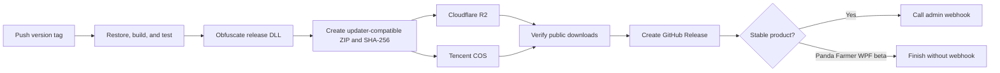

# Plugin Release Automation Plan

Status: implementation started; non-deploying Manderville pilot validated locally
Last updated: 2026-07-29
Primary user: `DomesticWarlord`

## Implementation checkpoint — 2026-07-29

Completed:

- Recovered the exact production ZIP layouts for all nine products from the VPS repository.
- Added a shared product configuration and updater-contract documentation.
- Added PowerShell scripts for explicit assembly versioning, package generation, SHA-256 output,
  and exact ZIP-entry validation.
- Added a reusable, non-deploying Windows GitHub Actions CI workflow.
- Updated the local Manderville Weapons pilot to use the LlamaLibrary NuGet package, PandaAuth
  `4.1.0`, and RebornBuddy reference assemblies `1.0.886`.
- Added a CI guard around Manderville's legacy local Reactor post-build target.
- Added a non-deploying Manderville GitHub Actions build workflow.
- Ran a full local Manderville Release build with `CI=true`: 0 errors.
- Generated and validated a four-entry Manderville compatibility ZIP locally.

Not yet done:

- The shared automation repository has been published, but no plugin repository changes have been
  committed or pushed.
- No Cloudflare or Tencent resources have been created or changed.
- No GitHub deployment secrets have been entered.
- Reactor has not been installed or exercised on a GitHub-hosted runner.
- No GitHub Release has been created and no webhook has been called.

## 1. Objective

Replace the current manual plugin release process with a reproducible GitHub Actions flow that:

1. Builds and validates each plugin from a Git tag.
2. Obfuscates release assemblies with the existing licensed .NET Reactor setup.
3. Produces an updater-compatible ZIP and SHA-256 checksum.
4. Uploads the exact same files to:
   - Cloudflare R2 for global users.
   - Tencent COS for mainland China users.
5. Verifies both public downloads.
6. Creates a GitHub Release.
7. Calls the Offset/admin update webhook only after every required release step succeeds.

Panda Farmer WPF is a beta replacement for Panda Farmer. It must build and publish beta artifacts but must **not** call the admin webhook. When WPF is promoted, it will take over Panda Farmer's stable release identity and webhook slot.

## 2. Scope

| Product | GitHub repository | Local checkout | Channel | Admin webhook |
|---|---|---|---|---|
| Panda Farmer | `DomesticWarlord/PandaFarmer` | `C:\Users\domes\OneDrive\Documentos\GitHub\PandaFarmer` | Stable | Yes |
| Panda Farmer WPF | `DomesticWarlord/PandaFarmerWPF` | `C:\Users\domes\OneDrive\Documentos\GitHub\PandaFarmerWPF` | Beta | No |
| Panda Triple Triad | `DomesticWarlord/PandaTripleTriad` | `C:\Users\domes\OneDrive\Documentos\GitHub\PandaTripleTriad` | Stable | Yes |
| Anima Weapons | `LlamaMagic/AnimaWeapons` | `C:\Users\domes\OneDrive\Documentos\GitHub\AnimaWeapons` | Stable | Yes |
| Manderville Weapons | `DomesticWarlord/MandervilleWeapons` | `C:\Users\domes\OneDrive\Documentos\GitHub\MandervilleWeapons` | Stable | Yes |
| Zodiac Weapons | `DomesticWarlord/ZodiacWeapons` | `C:\Users\domes\OneDrive\Documentos\GitHub\ZodiacWeapons` | Stable | Yes |
| Relic Weapons | `DomesticWarlord/RelicWeapons` | `C:\Users\domes\OneDrive\Documentos\GitHub\RelicWeapons` | Stable | Yes |
| Splendorous Tools | `DomesticWarlord/SplendorousTools` | `C:\Users\domes\OneDrive\Documentos\GitHub\SplendorousTools` | Stable | Yes |
| Beast Tribes | `LlamaMagic/BeastTribesPlugin` | `C:\Users\domes\OneDrive\Documentos\GitHub\BeastTribesPlugin` | Stable | Yes |

Panda Auth, Offset Server, and LlamaLibrary are dependencies/infrastructure. They are not release targets in this project.

## 3. Current repository state

All nine repositories are available locally as Git checkouts.

Observed branches:

| Repository | Current local branch |
|---|---|
| PandaFarmer | `master` |
| PandaFarmerWPF | `codex/panda-auth-protected-profiles` |
| PandaTripleTriad | `codex/panda-auth-protected-profiles` |
| AnimaWeapons | `main` |
| MandervilleWeapons | `main` |
| ZodiacWeapons | `master` |
| RelicWeapons | `master` |
| SplendorousTools | `master` |
| BeastTribesPlugin | `master` |

The connected GitHub app returned `404 Not Found` for all private repositories as of 2026-07-29. Local checkouts are therefore the reliable source until the connector authorization is fixed. The local `gh` CLI token was also invalid and must be refreshed before PR creation or GitHub Actions log inspection:

```powershell
gh auth login -h github.com
```

Do not confuse the local `gh` login with the Codex GitHub connector; they use separate authorization.

### Uncommitted dependency changes

The following five local project files were changed but are not staged, committed, or pushed:

- `AnimaWeapons\AnimaWeapons.csproj`
- `MandervilleWeapons\MandervilleWeapons.csproj`
- `ZodiacWeapons\ZodiacWeapons.csproj`
- `RelicWeapons\RelicWeapons.csproj`
- `BeastTribesPlugin\BeastTribes.csproj`

Each machine-specific reference:

```xml
<Reference Include="LlamaLibrary">
  <HintPath>C:\DataHome\Backupstuff\...\LlamaLibrary.dll</HintPath>
  <Private>false</Private>
</Reference>
```

was replaced with:

```xml
<PackageReference Include="LlamaLibrary" Version="26.729.1252.39" />
```

NuGet's official API confirmed that `26.729.1252.39` is published. All five conversions compiled successfully:

- Anima Weapons: compile-only MSBuild validation passed.
- Manderville Weapons: compile-only MSBuild validation passed.
- Zodiac Weapons: compile-only MSBuild validation passed.
- Relic Weapons: WPF `CoreBuild` validation passed.
- Beast Tribes: WPF `CoreBuild` validation passed.

Their full `dotnet build` commands still fail at the legacy post-build stage because the projects unconditionally invoke local .NET Reactor and local staging paths. The compilation itself succeeds.

## 4. Build inventory and known blockers

All projects are SDK-style projects targeting `net8.0-windows`. Use a GitHub-hosted Windows runner.

| Project | UI/build type | LlamaLibrary | PandaAuth | RebornBuddy refs | Special issue |
|---|---|---:|---:|---:|---|
| Panda Farmer | Library/WinForms | `25.1216.851.5` | `4.0.4` | `1.0.792` | Older package baseline |
| Panda Farmer WPF | WPF | `26.729.1252.39` | `4.1.0` | `1.0.886` | Beta; no webhook |
| Panda Triple Triad | WPF | `26.729.1252.39` | `4.1.0` | `1.0.886` | Modern baseline |
| Anima Weapons | Library/WinForms | `26.729.1252.39` | Requests `4.0.7` | `1.0.882` | Feed resolves PandaAuth `4.1.0` |
| Manderville Weapons | Library/WinForms | `26.729.1252.39` | Requests `4.0.7` | `1.0.882` | Feed resolves PandaAuth `4.1.0` |
| Zodiac Weapons | Library/WinForms | `26.729.1252.39` | Requests `4.0.7` | `1.0.882` | Feed resolves PandaAuth `4.1.0` |
| Relic Weapons | WPF | `26.729.1252.39` | Requests `4.0.7` | `1.0.882` | Feed resolves PandaAuth `4.1.0` |
| Splendorous Tools | Library/WinForms | `25.1130.1823.45` | `4.0.7` | `1.0.784` | Missing relative `LlamaAuth.dll`; COM reference |
| Beast Tribes | WPF | `26.729.1252.39` | Requests `4.0.7` | `1.0.882` | Feed resolves PandaAuth `4.1.0` |

The existing package sources are:

```text
https://api.nuget.org/v3/index.json
https://gitea.llamamagic.net/api/packages/DomesticWarlord/nuget/index.json
```

The Gitea feed allowed anonymous package restore during local validation.

### Required dependency normalization

Validate, then align projects toward:

```text
LlamaLibrary: 26.729.1252.39
PandaAuth: 4.1.0
RebornBuddy.ReferenceAssemblies: 1.0.886
```

Do not blindly update all projects at once. Update and compile one project at a time because older source may depend on changed APIs.

Splendorous Tools must be investigated before CI implementation. It references:

```text
..\..\..\llamaauth\LlamaAuth.dll
```

No matching `LlamaAuth.dll` was found locally. Determine whether it is unused, should be replaced with PandaAuth, or must come from a package/artifact.

## 5. Desired architecture



Release requirements:

- Build once; upload identical bytes everywhere.
- A failed restore, compile, obfuscation, upload, or verification must prevent the webhook.
- Versioned objects are immutable.
- Re-running the same tag is idempotent.
- If an existing version has a different checksum, fail instead of overwriting it.
- Do not delete older releases automatically.
- Keep GitHub Release assets and workflow artifacts for rollback/auditing.

## 6. Release channels and object layout

Recommended R2 and COS layout:

```text
plugins/<product-slug>/<channel>/<version>/<archive>
plugins/<product-slug>/<channel>/<version>/<archive>.sha256
```

Examples:

```text
plugins/panda-farmer/stable/1.2.3.4/PandaFarmer.zip
plugins/panda-farmer/beta/1.2.3.4/PandaFarmerWPF.zip
plugins/panda-triple-triad/stable/1.2.3.4/PandaTripleTriad.zip
plugins/anima-weapons/stable/1.2.3.4/AnimaWeapons.zip
```

Panda Farmer WPF remains under the beta channel and never touches the stable admin record. On promotion:

1. Validate updater compatibility.
2. Change WPF's release channel from `beta` to `stable`.
3. Assign Panda Farmer's stable product/webhook identity.
4. Stop releases from the legacy PandaFarmer repository.
5. Retain prior stable archives for rollback.

## 7. Artifact contract to confirm

The old post-build targets appear to stage some combination of:

```text
<Plugin>.dll
<Plugin>Loader.cs
Version.txt
PandaAuth.dll
changelog.txt (selected projects)
```

They then create `<Plugin>.zip`.

Before implementing packaging:

1. Inspect the current VPS copies and downloadable ZIPs.
2. Find the user's old batch copy script if it exists outside the repositories.
3. Record the exact directory structure and filenames for every plugin.
4. Confirm whether clients require the existing URL paths.
5. Confirm whether PandaAuth must remain bundled.
6. Confirm whether profiles/data files are embedded or copied separately.

LlamaLibrary should normally be a compile-time project dependency and should not be bundled with each plugin. Runtime behavior comes from the user's installed `QuestBehaviors\__LlamaLibrary` folder. Confirm this with the current client/plugin installation model.

The VPS alias is:

```powershell
ssh panda-vps
```

The global SSH configuration supplies the host, root user, host key, and identity. Remote inspection must remain read-only until the release layout is understood. Do not delete or replace VPS files during planning.

## 8. Versioning decision

Choose and document one release version source.

Recommended:

- Git tag is authoritative.
- Tags use `v<version>`, for example `v1.4.2.0`.
- The workflow strips `v`, passes the version to MSBuild, and verifies the generated assembly version.
- The same version appears in:
  - Assembly metadata.
  - `Version.txt`.
  - Object path.
  - GitHub Release.
  - Admin update record.

Do not use unpinned "latest" dependency versions in release workflows.

If existing clients require date/time versions like `26.729.1252.39`, preserve that format but still make the Git tag authoritative.

## 9. Legacy post-build replacement

Current project targets unconditionally:

- Run local `.NET Reactor`.
- Copy an obfuscated DLL into local staging directories.
- Generate the loader and `Version.txt`.
- Copy PandaAuth.
- ZIP the staging folder.
- Write into local release paths.

These operations must be removed from normal build behavior.

Preferred design:

1. Normal project builds only compile.
2. A checked-in packaging script stages release files explicitly.
3. GitHub Actions installs Reactor and invokes obfuscation explicitly.
4. The workflow calls the packaging script.

If old targets must remain temporarily, guard them:

```xml
<Target
  Name="PostBuild"
  AfterTargets="PostBuildEvent"
  Condition="'$(RunReleasePackaging)' == 'true'">
```

Normal builds use the default `false`. Release Actions may set it only when all required tooling and paths are defined.

Do not use `bin\Release` wholesale as the archive source. It contains copied reference assemblies such as `RebornBuddy.dll`, `GreyMagic.dll`, `Ijwhost.dll`, LlamaLibrary, PDBs, and `.deps.json` files that may not belong in the updater package.

## 10. .NET Reactor

Most/all projects contain `.nrproj` Reactor project files and existing post-build commands.

Use the same general CI approach already present in the PandaAuth Gitea workflow:

1. Store the license as base64 in a protected GitHub environment secret:

   ```text
   REACTOR_LICENSE_BASE64
   ```

2. Materialize it only in the runner's temporary directory.
3. Install Reactor.
4. Obfuscate the built plugin DLL.
5. Replace/stage the obfuscated output.
6. Never upload the license as an artifact.

Before implementation:

- Confirm the license permits GitHub-hosted CI use.
- Confirm the Reactor GitHub actions to use.
- Pin third-party actions to full commit SHAs where practical.
- Validate every `.nrproj` input/output path.

## 11. GitHub Actions design

### CI workflow

Each repository gets `.github/workflows/ci.yml`:

- Trigger: pull requests and pushes to the primary branch.
- Runner: Windows.
- Permissions: `contents: read`.
- No deployment secrets.
- Restore from NuGet.org and the DomesticWarlord Gitea feed.
- Compile/build with legacy release packaging disabled.
- Run tests if a repository gains tests.
- Upload build diagnostics only when useful.

There are currently no meaningful automated tests visible in the nine plugin repositories, so build validation is initially the main CI gate.

### Release workflow

Each repository gets a small `.github/workflows/release.yml` that calls a shared reusable workflow with product-specific inputs.

Trigger:

```yaml
on:
  push:
    tags:
      - "v*"
```

Minimum job permissions:

```yaml
permissions:
  contents: write
```

Recommended:

- Use a GitHub `production` environment for stable deployments.
- Initially require manual approval.
- Restrict deployments to `v*` tags.
- Use concurrency:

  ```yaml
  concurrency:
    group: release-${{ vars.PRODUCT_SLUG }}
    cancel-in-progress: false
  ```

### Shared workflow location

Recommended: store a reusable workflow in a dedicated public or otherwise cross-repository-accessible repository, then pin callers to a commit SHA.

The current workspace is:

```text
C:\Users\domes\OneDrive\Documentos\GitHub Release Work Flow
```

It is an empty Git repository suitable for holding:

- Reusable release workflow.
- Packaging scripts/templates.
- Configuration documentation.
- Example caller workflows.

A remote repository name/owner and visibility still need to be chosen. Because release repositories exist under both `DomesticWarlord` and `LlamaMagic`, a public reusable-workflow repository is operationally simplest. It must contain no credentials.

## 12. Cloudflare R2

Recommended initial configuration:

```text
Bucket: ffxivbots-releases
Hostname: downloads.ffxivbots.com
```

Setup:

1. Ensure the domain is managed in the same Cloudflare account.
2. Enable R2 billing.
3. Create the bucket.
4. Attach the production custom domain.
5. Use `r2.dev` only for initial testing, then disable it.
6. Add cache rules:
   - Long cache lifetime for immutable version paths.
   - Bypass or short TTL for mutable manifests, if any.
7. Create an R2 Object Read & Write API token scoped only to the releases bucket.
8. Put credentials directly into GitHub secrets; never share them in chat.

Required GitHub secrets:

```text
R2_ACCESS_KEY_ID
R2_SECRET_ACCESS_KEY
```

Required GitHub variables:

```text
R2_ENDPOINT
R2_BUCKET
R2_PUBLIC_BASE_URL
```

Typical endpoint:

```text
https://<cloudflare-account-id>.r2.cloudflarestorage.com
```

Official references:

- https://developers.cloudflare.com/r2/get-started/s3/
- https://developers.cloudflare.com/r2/api/tokens/
- https://developers.cloudflare.com/r2/buckets/public-buckets/

## 13. Tencent COS

Tencent remains the China distribution target. Cloudflare R2 should not replace it.

Required information:

- COS bucket name including APPID.
- Region.
- Current public/CDN hostname.
- Existing object path layout.
- Whether clients have hardcoded URLs.

Use a dedicated Tencent CAM sub-user with least-privilege permissions for only the required bucket/prefix. Store credentials directly as GitHub secrets.

Required secrets:

```text
TENCENT_SECRET_ID
TENCENT_SECRET_KEY
```

Required variables:

```text
TENCENT_COS_BUCKET
TENCENT_COS_REGION
TENCENT_PUBLIC_BASE_URL
```

Use Tencent's official COSCLI. Do not use destructive synchronization such as `sync --delete`. Upload only the intended archive and checksum, then verify the public URL.

Official references:

- https://www.tencentcloud.com/document/product/436/43265
- https://www.tencentcloud.com/document/product/436/43257
- https://www.tencentcloud.com/document/product/436/32972/

## 14. Admin webhook

The webhook key shared in the original conversation must be considered exposed. Do not copy it into this plan, code, commits, workflow logs, or future chats. Ask Kayla to rotate it.

The supplied example was written for Gitea and used:

```yaml
if: startsWith(gitea.ref, 'refs/tags/')
```

GitHub uses `github.ref`, but a tag-only release workflow does not need that condition.

Do not use the third-party `wei/curl` action for a secret-bearing request. Use the runner's native `curl`.

Target form:

```yaml
- name: Notify update service
  if: ${{ vars.CALL_ADMIN_WEBHOOK == 'true' }}
  shell: bash
  env:
    UPDATE_WEBHOOK_KEY: ${{ secrets.UPDATE_WEBHOOK_KEY }}
    PRODUCT_NAME: ${{ vars.UPDATE_PRODUCT_NAME }}
  run: |
    curl \
      --fail-with-body \
      --silent \
      --show-error \
      --retry 3 \
      --max-time 30 \
      --request POST \
      --data-urlencode "secret=${UPDATE_WEBHOOK_KEY}" \
      "https://update.ffxivbots.com/Webhooks?product=${PRODUCT_NAME}"
```

Do not send the secret over the current plain HTTP port. Kayla must confirm:

- HTTPS endpoint.
- Exact, case-sensitive product value for each stable plugin.
- Expected success status/body.
- Whether duplicate requests are idempotent.
- How the service discovers the new version and URLs.
- How to roll back to a prior version.

Panda Farmer WPF sets:

```text
CALL_ADMIN_WEBHOOK=false
```

## 15. GitHub configuration

Because repositories span `DomesticWarlord` and `LlamaMagic`, organization-level secrets may not cover all repositories. Options:

1. Add the same narrowly scoped deployment secrets to each repository.
2. Use organization secrets separately under each owner/org.
3. Create a dedicated deployment repository/service later.

Start with repository or environment secrets for clarity.

Suggested variables per repository:

```text
PRODUCT_SLUG
RELEASE_CHANNEL
ARCHIVE_NAME
PROJECT_PATH
REACTOR_PROJECT_PATH
UPDATE_PRODUCT_NAME
CALL_ADMIN_WEBHOOK
R2_OBJECT_PREFIX
TENCENT_OBJECT_PREFIX
```

Suggested shared secrets:

```text
REACTOR_LICENSE_BASE64
R2_ACCESS_KEY_ID
R2_SECRET_ACCESS_KEY
TENCENT_SECRET_ID
TENCENT_SECRET_KEY
UPDATE_WEBHOOK_KEY
```

Use GitHub's built-in `GITHUB_TOKEN` for GitHub Release creation. Do not create a separate GitHub PAT unless connector/workflow limitations prove it necessary.

## 16. Release step order

The release workflow must use this order:

1. Check out the exact tag.
2. Validate the tag/version.
3. Set up the pinned .NET SDK.
4. Configure package sources.
5. Restore.
6. Compile/build without legacy post-build deployment.
7. Run tests, if present.
8. Materialize Reactor license.
9. Install Reactor.
10. Obfuscate the release DLL.
11. Create a clean staging directory.
12. Generate loader and `Version.txt`.
13. Copy only approved runtime files.
14. Create ZIP.
15. Generate SHA-256.
16. Upload workflow rollback artifact.
17. Upload ZIP/checksum to R2.
18. Upload the same ZIP/checksum to Tencent COS.
19. Verify both public destinations.
20. Create the GitHub Release and attach ZIP/checksum.
21. Call the admin webhook for stable products only.
22. Write a deployment summary containing version, URLs, and checksums.

If step 17, 18, 19, or 20 fails, step 21 must never run.

## 17. Verification

For each release:

- Verify the ZIP exists and is non-empty.
- Inspect ZIP entries against the approved artifact contract.
- Verify the same SHA-256 is published to:
  - GitHub Release.
  - R2.
  - Tencent COS.
- Perform `HEAD` or download checks against both public URLs.
- Ideally download both public objects and verify their SHA-256.
- Confirm the admin site changed only after both mirrors passed.
- Confirm WPF beta did not touch the admin site.

## 18. Rollout

Recommended pilot: Manderville Weapons.

Rollout:

1. Normalize Manderville dependencies.
2. Make legacy packaging conditional/remove it.
3. Implement clean CI.
4. Reproduce the current ZIP locally.
5. Upload a non-production test object to R2.
6. Upload a non-production test object to Tencent.
7. Compare hashes and ZIP layout.
8. Run a tagged release with production approval but webhook disabled.
9. Enable webhook for a second controlled release.
10. Observe global and China downloads.
11. Apply the pattern to the remaining stable plugins.
12. Add Panda Farmer WPF with beta/no-webhook configuration.

Keep VPS-hosted releases untouched for at least two successful production release cycles. Retire the old batch/VPS distribution path only after updater compatibility is proven.

## 19. Open questions

### User

- Where is the old batch copy script?
- What are the current global and Tencent download URLs?
- What ZIP layout does each updater expect?
- Should PandaAuth remain inside every plugin ZIP?
- What version format should tags use?
- Which plugin should be the pilot if not Manderville Weapons?
- Is `downloads.ffxivbots.com` acceptable?
- Is one shared R2 bucket acceptable?
- Which GitHub owner should host the reusable workflow repository?

### Kayla/admin service

- Rotated webhook key.
- HTTPS endpoint.
- Exact product mappings.
- Expected response.
- Idempotency behavior.
- Version discovery mechanism.
- Rollback method.

### Cloudflare

- R2 enabled/billing status.
- Account/zone containing `ffxivbots.com`.
- Approved hostname.
- Bucket name.

### Tencent

- Bucket and APPID.
- Region.
- CDN/public hostname.
- Existing object paths.
- Least-privilege CAM credential.

### Codebase

- Purpose/replacement for Splendorous Tools' missing `LlamaAuth.dll`.
- Compatibility of older projects with current PandaAuth/RebornBuddy packages.
- Exact Reactor project path/output for each plugin.
- Whether stale `packages.config` files can be removed.

## 20. Definition of done

The migration is complete when:

- Every repository builds on a clean GitHub-hosted Windows runner.
- No project requires an absolute developer-machine path.
- Release artifacts are reproducible and contain only approved files.
- Reactor obfuscation runs non-interactively without exposing its license.
- R2 and Tencent receive byte-identical versioned artifacts.
- Public URLs are verified before notification.
- Stable plugin releases notify the admin service over HTTPS.
- Panda Farmer WPF beta never notifies the admin service.
- A failed release cannot advertise a new version.
- Old versions remain available for rollback.
- Manual Rider builds, copy scripts, and direct VPS uploads are no longer required.

## 21. Handoff instructions for another Codex instance

Start by reading this file completely.

Then:

1. Inspect all nine local repositories and preserve existing user changes.
2. Confirm the five uncommitted LlamaLibrary PackageReference changes are still present.
3. Do not revert or overwrite unrelated local work.
4. Do not use or repeat the compromised webhook key from the original chat.
5. Keep Panda Farmer WPF's webhook disabled.
6. Inspect the VPS release layout read-only through `ssh panda-vps`.
7. Locate the old batch script.
8. Produce the per-plugin artifact contract table.
9. Resolve Splendorous Tools' LlamaAuth reference.
10. Normalize package versions one project at a time with build verification.
11. Do not create Cloudflare/Tencent resources, push commits, or trigger production releases without user authorization.

The next concrete planning deliverable should be:

```text
repository
→ primary branch
→ project path
→ Reactor project
→ version source
→ ZIP name
→ exact ZIP entries
→ R2 object key
→ Tencent object key
→ admin product value
→ webhook enabled/disabled
```
